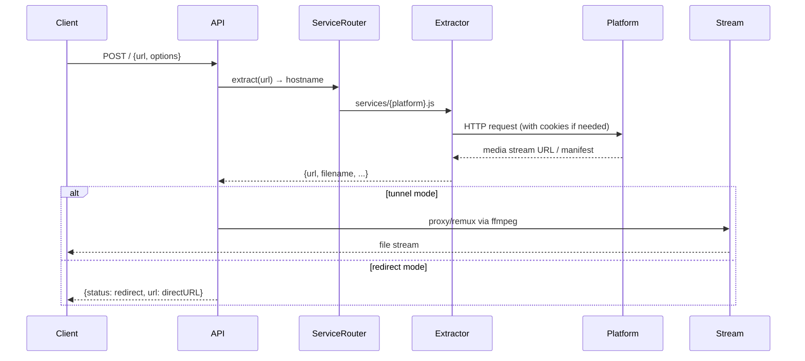

# cobalt

$$\text{Cobalt} = \text{URL} \xrightarrow{POST\;/} \text{ServiceRouter}(21\;\text{platforms}) \to \text{Stream/Redirect/Picker} \to \text{File}$$

## 3W 定位

$$\text{3W} = What(\text{API-first 多平台媒體下載代理}) + Why(\text{無廣告/無追蹤/無快取的乾淨下載體驗}) + How(\text{即時串流 proxy，不落地任何內容})$$

**What**：cobalt 是一個 self-hostable 的媒體下載 API + Web UI，使用者貼入 URL，cobalt 即時代理或重新混流後回傳檔案。不快取任何內容，作為「fancy proxy」運作。

**Why**：現有下載工具（yt-dlp 等）需 CLI 操作，且多數線上下載服務充斥廣告、追蹤器、付費牆。cobalt 定位為乾淨的 API 優先解法，適合整合到後端服務。

**How**：Node.js + Express API，接收 `POST /` 帶 JSON body（url + 選項），對應 21 個 service extractor 取得串流 URL，以 tunnel proxy 或 redirect 方式回傳給客戶端。

## 場景與市場

$$\text{Market} = \text{開發者整合} + \text{自架下載服務} + \text{個人媒體管理}$$

- 主要用途：self-hosted 個人或小型團隊的媒體下載 API 服務
- 典型場景：整合進 Eagle/媒體管理應用的「URL 匯入」功能後端
- 熱門程度：39.3k stars，Discord 社群活躍，官方 instance cobalt.tools
- **重要限制**：官方 hosted instance 不允許程式化使用，必須自行部署

## 技術棧

$$\text{TechStack} = \text{Node.js 18+} + \text{Express} + \text{pnpm monorepo} + \text{SvelteKit（Web）} + \text{Docker} + \text{Redis（rate limit）}$$

```
packages/
├── api/          # Node.js + Express，AGPL-3.0
│   └── src/
│       ├── core/         # API server, env, tunnel
│       ├── processing/   # URL 解析, service router, schema
│       │   └── services/ # 21 個 extractor（youtube, tiktok, twitter...）
│       ├── stream/       # ffmpeg, HLS, proxy stream
│       └── security/     # JWT, API key, Turnstile
└── web/          # SvelteKit，CC-BY-NC-SA-4.0
```

**依賴**：express, cors, zod（schema validation）, undici（HTTP），ffmpeg（remux）, Redis（rate limit）

## 架構分析

$$\text{Architecture} = \text{Monorepo}(\text{api} + \text{web} + \text{packages}) \to \text{Single Docker image}(\text{api only})$$

**Request 流程**：
```
POST / {url, videoQuality, downloadMode, ...}
  → schema.js (zod validation)
  → url.js (extract hostname)
  → service-config.js (pattern matching)
  → match.js (service dispatcher)
  → services/{platform}.js (extractor)
  → stream/manage.js (tunnel 或 redirect)
  → Response {status: tunnel|redirect|picker|error}
```

**關鍵設計決策**：
- **無快取原則**：所有內容即時 proxy，cobalt 不儲存任何媒體
- **Service extractor 模式**：每個平台獨立 `.js` 檔，易於擴充
- **Auth 雙軌制**：Api-Key（固定）+ Bearer JWT（短效，用於 Turnstile 人機驗證）
- **Rate limit**：Redis 支援，支援 cluster 模式
- **Local processing 模式**：新增 `localProcessing: "preferred"` 讓客戶端本地 remux，降低伺服器負載

## 資料流程



## 使用者操作流程（API 整合角度）

$$\text{IntegrationFlow} = \text{Self-host cobalt} \to \text{POST /\{url\}} \to \text{Handle}(\text{tunnel}|\text{redirect}|\text{picker}) \to \text{Download to Eagle}$$

**最小整合範例**：
```python
import httpx

async def cobalt_download(url: str, cobalt_api: str = "http://localhost:9000"):
    resp = await httpx.post(cobalt_api, json={"url": url}, headers={
        "Accept": "application/json",
        "Content-Type": "application/json",
        "Authorization": "Api-Key your-key"
    })
    data = resp.json()
    
    if data["status"] == "redirect":
        # 直接下載 data["url"]
        return data["url"], data["filename"]
    elif data["status"] == "tunnel":
        # 從 cobalt tunnel 下載（串流）
        return data["url"], data["filename"]
    elif data["status"] == "picker":
        # 多媒體選擇（如 Instagram 圖集）
        return data["picker"]  # list of {type, url, thumb}
```

**Docker 啟動**：
```yaml
services:
  cobalt-api:
    image: ghcr.io/imputnet/cobalt:11
    ports: ["9000:9000"]
    environment:
      API_URL: "http://localhost:9000"
      API_KEY_URL: "file:///keys.json"
```

## API 入口

| Endpoint | Method | 說明 |
|----------|--------|------|
| `/` | POST | 主下載端點，接收 url + 選項 |
| `/` | GET | 取得 instance 資訊（版本/支援平台清單） |
| `/session` | POST | 申請 JWT Bearer token（需 Turnstile） |
| `/tunnel` | GET | 串流代理端點（由上一步回傳 URL 觸發） |

**Request body 關鍵欄位**：
- `url` (required)：目標 URL
- `downloadMode`: `auto / audio / mute`
- `videoQuality`: `max / 1080 / 720 / ...`
- `audioFormat`: `mp3 / ogg / wav / opus`
- `localProcessing`: `disabled / preferred / forced`（新功能：客戶端本地 remux）

**Response status 四種**：`tunnel` / `redirect` / `picker` / `error`

## 交叉比對

$$\text{CrossRef} = \text{Eagle Viewer}(\text{URL 匯入 wf-007}) + \text{MeTube}(\text{web UI 競品參考})$$

- **Eagle Viewer wf-007**：cobalt self-hosted API 是 URL 匯入功能的最佳後端選項，覆蓋主流西方平台
- **MeTube**：同樣是 yt-dlp 包裝，但 MeTube 走 WebSocket 佇列模式；cobalt 走 REST API 同步模式，更適合後端整合

## 競品比較

| | cobalt | yt-dlp（直接） | MeTube |
|--|--------|--------------|--------|
| 設計模式 | REST API | CLI | Web UI + queue |
| 整合方式 | HTTP JSON | subprocess | WebSocket / HTTP |
| 支援平台 | 21（精選） | 1700+ | 1700+（via yt-dlp） |
| 抖音/小紅書 | ❌ | ⚠️ 需 cookie | ⚠️ 需 cookie |
| Line VOOM | ❌ | ❌ | ❌ |
| 無快取 | ✅ 設計原則 | ✅ | ✅ |
| Docker | ✅ 官方 | N/A | ✅ 官方 |
| Auth | API Key + JWT | 無 | 無（自行加） |

## 採用決策

$$\text{Decision} = \text{cobalt}(\text{主力：YouTube/TikTok/X/Instagram/Facebook 等主流平台}) + \text{yt-dlp}(\text{補位：抖音/小紅書/其他 1700+ 平台})$$

**採用理由**：
1. **API 設計最乾淨**：標準 REST JSON，無需 CLI subprocess
2. **無快取原則**：符合 Eagle Viewer 的隱私設計
3. **Docker self-hostable**：可與 Eagle Viewer serve.py 共同部署
4. **picker response**：直接支援圖集下載（Instagram/TikTok 多圖）

**不採用 cobalt 的場景**：
- 抖音（Douyin）→ yt-dlp + fresh cookie
- 小紅書（XiaoHongShu）→ yt-dlp + cookie（不穩）或 Apify
- Line VOOM → Playwright headless（待研究）
- 其他冷門平台 → yt-dlp 直接呼叫

**整合策略**：
```
serve.py /api/import/start
  → detect platform
  → if cobalt_supported: POST cobalt_api/{url}
  → else: subprocess yt-dlp --cookies-from-browser chrome {url}
  → save to Eagle library
```

**當前調研結論**：**強烈推薦採用**，作為 Eagle Viewer URL 匯入的主力後端，搭配 yt-dlp 做補位。
