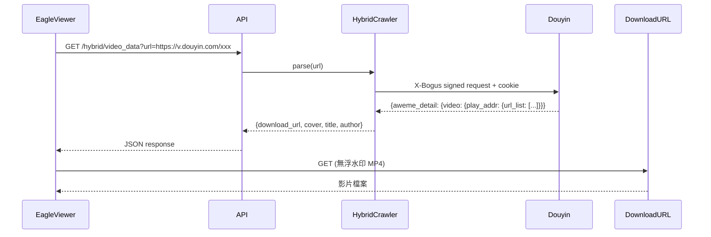

# Douyin_TikTok_Download_API

$$\text{DouyinAPI} = \text{URL} \xrightarrow{GET\;/hybrid/video\_data} \text{HybridCrawler}(\text{Douyin}|\text{TikTok}|\text{Bilibili}) \to \{download\_url,\;no\_watermark\}$$

## 3W 定位

$$\text{3W} = What(\text{抖音/TikTok/Bilibili 專用下載 REST API}) + Why(\text{yt-dlp/cobalt 無法穩定處理的中文平台}) + How(\text{逆向 X-Bogus + A-Bogus 算法偽裝合法 Web 請求})$$

**What**：高效能非同步 REST API，解析抖音、TikTok、Bilibili 的影片/圖集資料，回傳無浮水印下載 URL。同時提供 Web UI（PyWebIO）供手動使用，iOS 捷徑整合，pip 套件可直接 import。

**Why**：yt-dlp 的抖音 extractor 長期存在 fresh cookie 問題（issue #7863 開了兩年），cobalt 不支援抖音/Bilibili。中國開發者針對性逆向私有 API 提供了更穩定的替代方案。

**How**：使用 `X-Bogus` + `A-Bogus` 演算法模擬抖音 Web 端請求簽名，配合 config.yaml 中設定的 cookie，繞過平台 API 的 bot 防護。

## 場景與市場

$$\text{Market} = \text{個人內容歸檔} + \text{數據分析} + \text{iOS 捷徑無浮水印下載} + \text{開發者 API 整合}$$

- 主要用途：抖音/TikTok 影片、圖集無浮水印下載
- 典型場景：Eagle Viewer 的抖音 URL 匯入後端
- 熱門程度：12.1k stars，有付費商業版（TikHub.io 700+ endpoints）
- 活躍度：v4.1.2（2025-03-16），持續維護

## 技術棧

$$\text{TechStack} = \text{Python + FastAPI + HTTPX（async）} + \text{PyWebIO（Web UI）} + \text{X-Bogus/A-Bogus 算法} + \text{Docker}$$

```
app/
├── api/
│   ├── router.py           # 路由聚合
│   └── endpoints/
│       ├── hybrid_parsing.py   # 主要：自動判斷平台
│       ├── douyin_web.py       # 抖音 Web API
│       ├── tiktok_web.py       # TikTok Web API
│       ├── tiktok_app.py       # TikTok App API
│       ├── bilibili_web.py     # Bilibili
│       └── download.py         # 直接下載
└── web/app.py             # PyWebIO Web UI

crawlers/
├── douyin/web/            # 抖音 Web 爬蟲（X-Bogus）
├── tiktok/web/            # TikTok Web 爬蟲
├── tiktok/app/            # TikTok App API 爬蟲
├── bilibili/              # Bilibili 爬蟲
└── hybrid/                # 統一入口（自動判斷）
```

## 架構分析

$$\text{Architecture} = \text{FastAPI}(\text{REST + OpenAPI 文件}) + \text{HybridCrawler}(\text{URL 解析 → 平台判斷 → 對應 extractor})$$

**核心流程**：
```
GET /hybrid/video_data?url={url}
  → HybridCrawler.hybrid_parsing_single_video(url)
    → if "douyin" in url → DouyinWebCrawler.get_aweme_id(url) → fetch_one_video(aweme_id)
    → if "tiktok" in url → TikTokWebCrawler / TikTokAPPCrawler
    → if "bilibili" in url → BilibiliWebCrawler.get_bv_id(url) → ...
  → return {download_url, cover_url, author, title, ...}
```

**Cookie 管理**：
- 部署前在 `config.yaml` 設定抖音 cookie
- 也可透過 `POST /hybrid/update_cookie` 動態更新
- Cookie 不需登入帳號，只需從瀏覽器取得 session cookie

**算法維護現實**：
- X-Bogus / A-Bogus 是抖音私有簽名算法，平台更新時需重新逆向
- 作者透過 GitHub issue 和微信群維護更新
- v4.0.7 曾使用 TikTok APP API 解決 HTTP 403 問題（顯示有能力快速響應平台變化）

## 資料流程



## 使用者操作流程（Eagle Viewer 整合角度）

$$\text{Integration} = \text{Self-host} \to \text{GET /hybrid/video\_data?url=\{url\}} \to \text{Parse JSON} \to \text{Download file}$$

**最小整合範例**：
```python
import httpx

async def download_douyin(url: str, api_base: str = "http://localhost:80"):
    resp = await httpx.get(f"{api_base}/hybrid/video_data", params={"url": url})
    data = resp.json()
    
    if data["code"] == 200:
        video_data = data["data"]
        # 無浮水印下載 URL
        download_url = video_data["video"]["play_addr"]["url_list"][0]
        filename = f"{video_data['author']['nickname']}_{video_data['aweme_id']}.mp4"
        return download_url, filename
    # 圖集
    elif video_data.get("aweme_type") in [68, 150]:  # 圖集類型
        images = video_data["images"]
        return [img["url_list"][0] for img in images], ...
```

**Docker 部署**：
```bash
# 先修改 config.yaml 填入抖音 cookie
docker-compose up -d
# API 預設在 port 80，文件在 /docs
```

## API 入口

| Endpoint | 說明 |
|----------|------|
| `GET /hybrid/video_data?url=` | **主要**：自動判斷抖音/TikTok，回傳完整資料 |
| `GET /douyin/web/...` | 抖音專用端點（用戶、合集、直播等） |
| `GET /tiktok/web/...` | TikTok Web 端點 |
| `GET /tiktok/app/...` | TikTok App API 端點 |
| `GET /bilibili/web/...` | Bilibili 端點 |
| `POST /hybrid/update_cookie` | 動態更新 cookie（不需重啟） |
| `GET /docs` | OpenAPI 互動文件（FastAPI 自動生成） |

## 交叉比對

$$\text{CrossRef} = \text{Eagle Viewer wf-007}(\text{抖音 URL 匯入後端}) + \text{cobalt}(\text{互補：Western vs 中文平台})$$

- **與 cobalt 的分工**：cobalt 主力西方平台，此 API 專責抖音/TikTok中國版/Bilibili
- **Eagle Viewer 整合**：serve.py 呼叫此 API 取得下載 URL，再下載到 Eagle library

## 競品比較

| | Douyin_TikTok_API | yt-dlp（抖音） | JoeanAmier/TikTokDownloader |
|--|-------------------|---------------|----------------------------|
| 抖音支援 | ✅ 專用 extractor | ⚠️ fresh cookie 持續問題 | ✅ 專用 |
| TikTok | ✅ | ✅ | ✅ |
| Bilibili | ✅ | ✅ | ❌ |
| 小紅書 | ❌ | ⚠️ | ❌ |
| 整合方式 | REST API | subprocess | Python API |
| Cookie 更新 | API endpoint | 手動 | 手動 |
| Docker | ✅ 官方 | N/A | ✅ |
| 維護狀態 | ✅ 2025-03 | ✅ | ✅ |

## 採用決策

$$\text{Decision} = \text{採用作為抖音/Bilibili URL 匯入後端} + \text{需自行維護 cookie}$$

**採用理由**：
1. **專門針對抖音設計**，比 yt-dlp fresh cookie 問題更穩定
2. **REST API 設計**，與 serve.py 整合方式與 cobalt 一致
3. **動態 cookie 更新**，不需重啟服務即可刷新 cookie
4. **OpenAPI 文件**，整合時開發體驗好

**風險**：
1. 抖音平台更新時 X-Bogus/A-Bogus 算法可能失效，需等作者更新（通常數天內）
2. Cookie 需要用戶定期刷新（約 1-4 週）
3. Apache-2.0 授權，商業使用需注意

**Cookie 管理建議**：
- Eagle Viewer 提供「更新抖音 Cookie」按鈕 → 呼叫 `POST /hybrid/update_cookie`
- 或直接讓用戶上傳 cookies.txt，serve.py 轉送給此 API

**當前調研結論**：**推薦採用**，作為 cobalt 的中文平台補位，專責抖音 + Bilibili。
