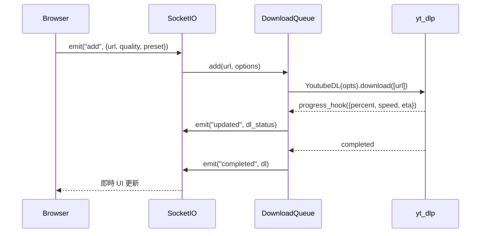

# MeTube

$$\text{MeTube} = \text{yt-dlp}(\text{引擎}) + \text{aiohttp}(\text{後端}) + \text{Socket.IO}(\text{即時通訊}) + \text{Angular}(\text{前端}) \to \text{Download Queue Web UI}$$

## 3W 定位

$$\text{3W} = What(\text{yt-dlp 的 Web UI 包裝，佇列管理}) + Why(\text{讓非 CLI 用戶輕鬆使用 yt-dlp 的 1700+ 平台}) + How(\text{Socket.IO 即時佇列 + Python asyncio 併發下載})$$

**What**：MeTube 是 yt-dlp 的 self-hosted Web UI，提供下載佇列管理、格式預設（presets）、頻道/播放清單訂閱、cookie 上傳等功能。

**Why**：yt-dlp 本身是 CLI 工具，MeTube 讓一般用戶無需 CLI 就能利用 yt-dlp 的完整能力。

**How**：Python aiohttp 後端 + Socket.IO 即時通訊（推送下載進度/狀態），Angular 前端，Docker 一鍵部署。

## 場景與市場

$$\text{Market} = \text{個人 NAS / homelab} + \text{家庭媒體伺服器} + \text{內容歸檔工作流}$$

- 主要用途：self-hosted 個人媒體下載管理
- 典型用戶：NAS 用戶（Synology/TrueNAS）、Plex/Jellyfin 媒體伺服器管理員
- 熱門程度：13.2k stars，AGPL-3.0，Docker nightly 自動更新 yt-dlp
- 特色功能：頻道訂閱（定時檢查新影片）、multi-preset 選擇、cookie 上傳

## 技術棧

$$\text{TechStack} = \text{Python 3 + aiohttp + asyncio} + \text{Socket.IO (python-socketio)} + \text{yt-dlp（subprocess-free 直接 API 呼叫）} + \text{Angular（前端）}$$

```
app/
├── main.py          # aiohttp 路由 + Socket.IO server + 業務邏輯
├── ytdl.py          # yt-dlp 整合層（DownloadQueue, Download, DownloadQueueNotifier）
├── dl_formats.py    # 格式/品質對應
├── subscriptions.py # 頻道/播放清單訂閱管理
└── state_store.py   # 持久化（JSON AtomicStore）

ui/src/
├── app/             # Angular components
└── main.ts          # 入口
```

**yt-dlp 整合方式**：直接 import `yt_dlp`（Python API），非 subprocess — 效能更好，可捕捉進度 hook。

## 架構分析

$$\text{Architecture} = \text{Socket.IO}(\text{雙向即時通訊}) + \text{aiohttp}(\text{靜態 + REST}) + \text{asyncio}(\text{非同步佇列，MAX\_CONCURRENT=3})$$

**下載流程**：
```
前端 → Socket.IO emit("add", {url, format, quality, ...})
  → ytdl.py DownloadQueue.add()
  → asyncio queue worker
  → yt_dlp.YoutubeDL.download() [帶 progress_hook]
  → Socket.IO emit("updated", {id, percent, speed, ...})
  → Socket.IO emit("completed", {id, ...})
```

**HTTP 路由**（REST 輔助）：
| 路由 | 說明 |
|------|------|
| `POST /add` | 新增下載（CORS 外部觸發用） |
| `POST /cancel-add` | 取消 |
| `POST /subscribe` | 訂閱頻道/播放清單 |
| `POST /upload-cookies` | 上傳 Netscape cookies.txt |
| `DELETE /delete-cookies` | 刪除 cookies |

**yt-dlp 三層 options 優先級**：
```
Global YTDL_OPTIONS（最低）
  → Preset（中）
  → Per-download override（最高，需 ALLOW_YTDL_OPTIONS_OVERRIDES=true）
```

## 資料流程



## 使用者操作流程

$$\text{Flow} = \text{貼 URL} \to \text{選格式/品質/preset} \to \text{加入佇列} \to \text{即時進度} \to \text{下載連結}$$

**Cookie 使用（針對需登入平台）**：
1. 從瀏覽器匯出 Netscape cookies.txt（EditThisCookie 等擴充）
2. 在 MeTube UI 上傳 cookies
3. yt-dlp 自動使用該 cookie 下載受保護內容

**訂閱模式**：
- 輸入頻道或播放清單 URL → 設定檢查間隔（預設 60 分鐘）
- MeTube 定期掃描末尾 50 個項目，新項目自動加入下載佇列

## API 入口

**Socket.IO events（主要介面）**：
| Event（client→server） | 說明 |
|----------------------|------|
| `connect` | 接收 all（現有佇列）、configuration、subscriptions_all |
| `add` | 新增下載 |
| `cancel` | 取消下載 |
| `clear` | 清除已完成 |
| `subscribe` | 新增訂閱 |

| Event（server→client） | 說明 |
|----------------------|------|
| `added` | 新下載加入佇列 |
| `updated` | 進度更新（percent/speed/eta） |
| `completed` | 下載完成 |
| `canceled` | 取消確認 |

**關鍵 env vars**：
```bash
YTDL_OPTIONS='{"cookiesfrombrowser": ["chrome"]}'  # 自動從瀏覽器取 cookie
YTDL_OPTIONS_PRESETS='{"4K": {"format": "bestvideo+bestaudio"}}'
MAX_CONCURRENT_DOWNLOADS=3
DOWNLOAD_DIR=/downloads
```

## 交叉比對

$$\text{CrossRef} = \text{Eagle Viewer}(\text{UI 設計參考}) + \text{cobalt}(\text{比較：REST vs Socket.IO})$$

- **Eagle Viewer 整合參考**：
  - MeTube 的三層 options 優先級設計 → Eagle Viewer 的 preset 系統
  - cookie 上傳 UI 設計 → Eagle Viewer 的平台 cookie 管理
  - 即時進度顯示（Socket.IO）→ Eagle Viewer URL 匯入進度 UI

- **與 cobalt 比較**：cobalt 更適合 Eagle Viewer 後端整合（REST JSON），MeTube 主要作為 UI 設計參考

## 競品比較

| | MeTube | cobalt | TubeArchivist |
|--|--------|--------|---------------|
| 平台支援 | 1700+（yt-dlp） | 21（精選） | YouTube only |
| 通訊協議 | Socket.IO | REST JSON | REST JSON |
| 佇列 | ✅ 內建 | ❌ 無 | ✅ 有 |
| 訂閱/自動下載 | ✅ | ❌ | ✅（YouTube only） |
| Cookie 管理 UI | ✅ 上傳介面 | ❌（env var） | ❌ |
| 媒體伺服器整合 | ❌ | ❌ | ✅ Jellyfin/Plex |
| Python / Node.js | Python | Node.js | Python |

## 採用決策

$$\text{Decision} = \text{不直接採用作為後端} + \text{參考：佇列設計 + Cookie UI + Preset 系統}$$

**參考價值**（Eagle Viewer 開發借鑒）：
1. **Cookie 上傳 UI**：`POST /upload-cookies` + Netscape cookies.txt 格式，直接套用
2. **三層 Options 優先級**：Global → Preset → Per-download override 設計模式
3. **Socket.IO 進度推送**：URL 匯入進度即時顯示的實作參考
4. **下載佇列管理**：cancel / clear / concurrent limit 設計

**不直接採用的原因**：
- Eagle Viewer 已有 `serve.py`，不需要額外的 Python server
- cobalt 的 REST API 更適合後端整合（無需 Socket.IO client）
- MeTube 是完整的獨立應用，整合成本 > 從零實作

**當前調研結論**：**設計參考**，不作為直接依賴。重點借鑒：cookie 管理、preset 系統、進度推送 UI。
