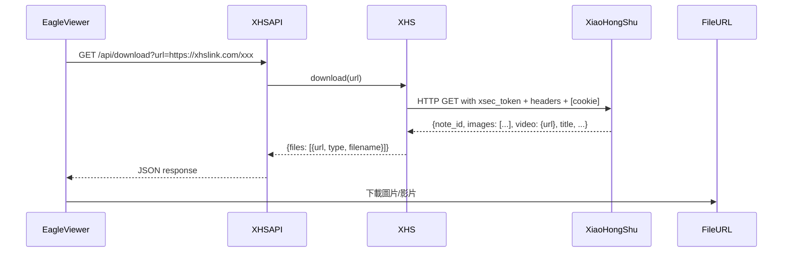

# XHS-Downloader

$$\text{XHS} = \text{URL}(\text{小紅書貼文}) \xrightarrow{\text{xsec\_token + headers}} \text{API}(\text{提取資源}) \to \{\text{圖片/影片/LivePhoto}\}$$

## 3W 定位

$$\text{3W} = What(\text{小紅書專用圖文/影片下載工具}) + Why(\text{小紅書無公開 API，captcha 擋截所有通用工具}) + How(\text{解析 xsec\_token + 模擬 headers，cookie 可選})$$

**What**：Python 工具/REST API，支援小紅書（RedNote/XiaoHongShu）的貼文下載，涵蓋圖集、影片、LivePhoto，無浮水印，支援批次下載和剪貼簿監控。

**Why**：cobalt 因 captcha 已 broken（issue #1457），yt-dlp 同樣被 captcha 擋截，其他通用工具無法穩定運作。此工具針對小紅書私有 API 專門開發。

**How**：解析 URL 中的 `xsec_token`，構造符合小紅書驗證要求的 headers。Cookie 為可選項（建議設定以取得高畫質影片），即使不登入帳號也可運作。

## 場景與市場

$$\text{Market} = \text{小紅書內容歸檔} + \text{圖集無浮水印下載} + \text{研究人員數據採集}$$

- 主要用途：小紅書貼文圖片、影片無浮水印批次下載
- 典型場景：Eagle Viewer 的小紅書 URL 匯入後端
- 熱門程度：高星數（Trendshift 上榜），GitHub Actions 自動建置執行檔
- 特色：Python 3.12+，支援 MCP server（Claude 整合），支援 TUI / CLI / API 三種模式

## 技術棧

$$\text{TechStack} = \text{Python 3.12 + FastAPI + HTTPX（HTTP/2）+ aiosqlite} + \text{FastMCP（MCP server）} + \text{Docker}$$

```
source/
├── application/
│   ├── app.py          # 主應用邏輯（XHS class）
│   ├── download.py     # 下載管理
│   ├── request.py      # HTTP 請求（cookie + headers）
│   ├── video.py        # 影片處理
│   ├── image.py        # 圖片處理
│   ├── explore.py      # 搜尋/探索
│   └── user_posted.py  # 用戶貼文列表
├── module/
│   ├── settings.py     # 設定管理
│   ├── manager.py      # 資源管理
│   └── model.py        # 資料模型
├── CLI/                # 命令列介面
└── TUI/                # 終端 UI
```

**三種啟動模式**：
1. `python main.py` → TUI 互動模式
2. `python main.py --api` → REST API server（port 5556）
3. `python main.py --mcp` → MCP server（供 Claude 直接呼叫）

## 架構分析

$$\text{Architecture} = \text{XHS class}(\text{異步下載引擎}) + \text{FastAPI}(\text{REST}) + \text{FastMCP}(\text{MCP server 雙模式})$$

**Cookie 設計哲學**：
- Cookie **不需要登入帳號**，只需從瀏覽器取得匿名 session cookie
- 不設定 cookie：可下載，但影片僅低畫質
- 設定 cookie：取得高畫質影片（推薦）
- 這是比 yt-dlp / cobalt 的關鍵優勢：不需要正式帳號 cookie

**xsec_token 機制**：
```
URL: https://www.xiaohongshu.com/explore/NoteID?xsec_token=XXXXX
                                                  ↑
                              小紅書 API 請求驗證 token，嵌在分享 URL 中
```

**剪貼簿監控**：
- 後台持續監控剪貼簿，偵測到小紅書 URL 自動下載
- 適合手機分享連結到電腦後立即存檔的工作流

## 資料流程



## 使用者操作流程（Eagle Viewer 整合角度）

$$\text{Integration} = \text{Self-host API（port 5556）} \to \text{GET /api/download?url=\{url\}} \to \text{Download files}$$

**啟動 API server**：
```bash
# Docker
docker run -p 5556:5556 joeanamier/xhs-downloader --api

# 或 uv
uv run python main.py --api
```

**整合範例**：
```python
import httpx

async def download_xhs(url: str, api_base: str = "http://localhost:5556"):
    resp = await httpx.get(f"{api_base}/api/download", params={"url": url})
    data = resp.json()
    # data 包含圖片 URL 列表或影片 URL
    return data
```

**Cookie 設定（建議）**：
- 從瀏覽器取得小紅書匿名 session cookie
- 寫入 `settings.json` 的 `cookie` 欄位
- 不需要登入帳號，只需匿名 session

## API 入口

API server 模式（port 5556）的端點文件需看 `source/application/app.py` 的 `setup_routes()`。

**已確認支援的操作**：
- 下載貼文（圖集 / 影片 / LivePhoto）
- 提取帳號發布 / 收藏 / 點讚清單
- 搜尋結果頁連結提取
- MCP server 模式供 Claude 直接呼叫

**支援的 URL 格式**：
```
https://www.xiaohongshu.com/explore/{NoteID}?xsec_token=XXX
https://www.xiaohongshu.com/discovery/item/{NoteID}?xsec_token=XXX
https://xhslink.com/{ShareCode}  ← 手機分享的短連結
```

## 交叉比對

$$\text{CrossRef} = \text{Eagle Viewer wf-007}(\text{小紅書 URL 匯入後端}) + \text{Douyin-API}(\text{姊妹工具，同作者 JoeanAmier})$$

- **JoeanAmier 的生態**：同一作者還維護 `TikTokDownloader`（抖音+TikTok）
- **Eagle Viewer 整合**：serve.py 偵測小紅書 URL → 呼叫此 API → 批次下載圖片/影片存入 Eagle

## 競品比較

| | XHS-Downloader | yt-dlp（小紅書） | cobalt（小紅書） |
|--|----------------|-----------------|-----------------|
| 小紅書支援 | ✅ 專用 | ⚠️ captcha 擋 | ❌ broken（issue #1457） |
| 圖集下載 | ✅ | ⚠️ | ❌ |
| LivePhoto | ✅ | ❌ | ❌ |
| Cookie 需求 | 可選（低畫質免 cookie） | 必須 | 無效 |
| 維護狀態 | ✅ 活躍 | ⚠️ 不穩 | ❌ 已知壞 |
| MCP 支援 | ✅ | ❌ | ❌ |

## 採用決策

$$\text{Decision} = \text{採用作為小紅書 URL 匯入後端} + \text{cookie 管理是關鍵操作成本}$$

**採用理由**：
1. **小紅書唯一可靠的開源解法**（cobalt 已 broken，yt-dlp 不穩）
2. **Cookie 門檻低**：匿名 cookie 即可運作，不需登入帳號
3. **API server + Docker**：與 Eagle Viewer serve.py 整合方式清晰
4. **圖集完整支援**：小紅書以圖集為主，此工具圖集支援最完整

**風險**：
1. GPL-3.0 授權，Eagle Viewer 若商業化需注意
2. 小紅書 API 更新時需等作者修復（通常數天）
3. 短連結（xhslink.com）需先展開才能取得 xsec_token

**Cookie 管理建議**：
- Eagle Viewer 提供「更新小紅書 Cookie」設定 UI
- 匿名 cookie 即可（從瀏覽器匯出，不需登入）
- 低風險：無帳號關聯，封禁風險低

**當前調研結論**：**推薦採用**，小紅書下載的最佳可行方案，無可替代。
